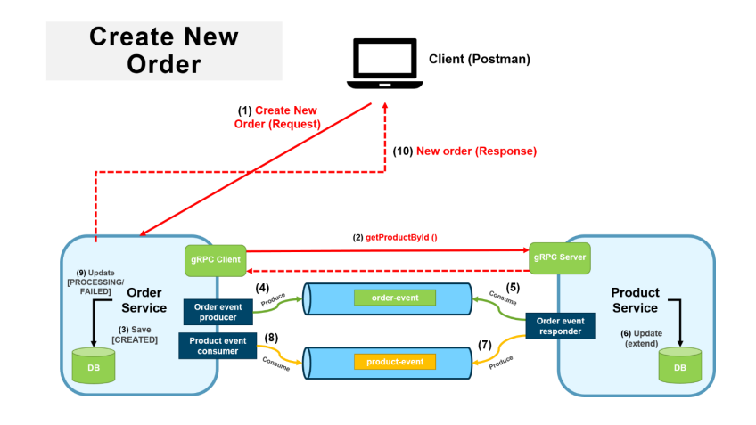
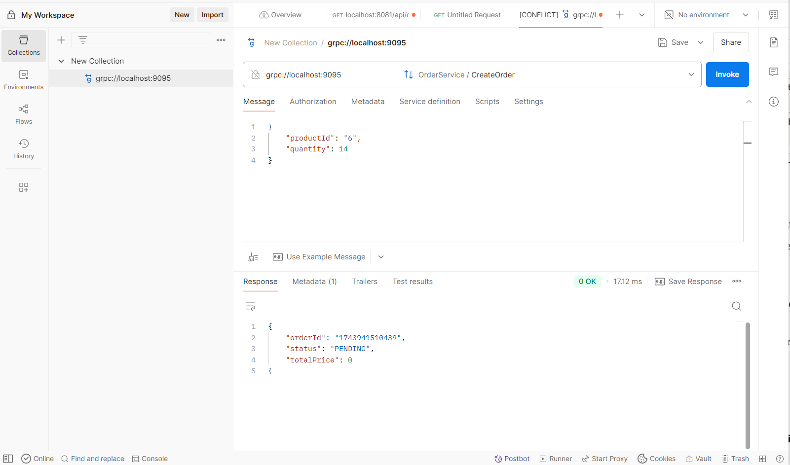
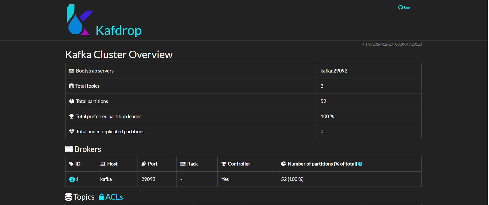

# Order Processing System
# 🛒 Inventory Order System - Distributed Transaction (Microservices)

This system implements the **Create Order** distributed transaction, using **Spring Boot**, **gRPC**, and a combination of **MongoDB** and **PostgreSQL** databases. The system handles order creation, Inventory availability checks, and order status updates based on the Inventory's availability. It ensures the integrity of the transaction across multiple microservices, following the **Saga Pattern** for managing distributed transactions.

---

## 📦 Tech Stack

| Layer              | Technology Used            |
|--------------------|----------------------------|
| Backend Services   | Spring Boot (REST APIs, gRPC) |
| Messaging          | Apache Kafka               |
| Databases          | MongoDB (Order Service), PostgreSQL (Inventory Service) |
| Containerization   | Docker & Docker Compose    |
| Build Tool         | Gradle                     |
| gRPC Communication | Protocol Buffers (protobuf)|
| Java Version       | Java 17+                   |
| Monitoring         | Kafdrop       # Order Processing System

## 📦 Overview

A microservices-based order processing system designed to handle inventory and order management using:

* **Frontend (Angular)**: UI for creating and viewing orders.
* **Backend (Spring Boot + gRPC)**: Order and Inventory microservices communicating via gRPC.
* **Docker**: Containerized services with Docker Compose.
* **Git**: GitHub-based collaboration using best practices.

---

## 🧱 Project Structure

```
/order-processing-system
├── backend/
│   ├── .gradle/
│   ├── .idea/
│   ├── assets/
│   │   └── architecture.png
│   ├── build/
│   ├── gradle/
│   ├── microservices/
│   │   ├── build/
│   │   ├── orderService/
│   │   ├── inventoryService/
│   │   ├── src/
│   │   └── build.gradle
│   ├── proto-api/
│   │   └── (gRPC .proto files)
│   ├── src/
│   ├── Utils/
│   │   ├── Custom exceptions/
│   │   ├── Models and DTOs/
│   │   ├── Events/
│   │   └── Global error handling/
│   ├── create-projects.bash
│   ├── build.gradle
│   ├── settings.gradle
│   ├── gradlew
│   ├── gradlew.bat
│   ├── .gitignore
│   └── docker-compose.yml
├── frontend/
│   ├── src/
│   │   ├── app/
│   │   │   ├── core/
│   │   │   ├── shared/
│   │   │   ├── features/
│   │   │   │   ├── inventory/
│   │   │   │   └── order/
│   │   │   ├── assets/
│   │   │   └── app.component.ts
│   │   ├── assets/
│   │   ├── environments/
│   │   │   ├── environment.ts
│   │   │   └── environment.prod.ts
│   │   └── main.ts
│   ├── angular.json
│   ├── package.json
│   ├── tsconfig.json
│   ├── tsconfig.app.json
│   ├── tsconfig.spec.json
│   ├── README.md
│   └── .gitignore
```

---

## 📘 Project Requirements

### 1. Microservices Architecture

* Spring Boot microservices:

  * Order Service
  * Inventory Service
* Communication via gRPC (not REST)

### 2. Angular Frontend

* UI with:

  * Form: Select product & quantity
  * Table: Display orders
* Uses Angular Services to communicate with backend via HTTP

### 3. gRPC Communication

* Define a .proto file (order.proto)

```proto
syntax = "proto3";
service OrderService {
  rpc CreateOrder(OrderRequest) returns (OrderResponse);
}
message OrderRequest {
  string product = 1;
  int32 quantity = 2;
}
message OrderResponse {
  string status = 1;
}
```

### 4. Docker Integration

* Dockerfile for each microservice
* docker-compose.yml to orchestrate services

### 5. Git Best Practices

* Feature branches
* Pull requests before merging
* Clear commit messages

---

## ✅ Tasks & Outcomes

### Task 1: Order Service Setup

* Spring Boot App with Order entity
* gRPC Server for order creation

✔ Outcome: `POST /orders` and gRPC service

### Task 2: Inventory Service Setup

* Spring Boot App with Product entity
* gRPC Server for inventory check

✔ Outcome: gRPC inventory check/update method

### Task 3: gRPC Communication

* Implement gRPC client in Order Service
* Order Service checks stock before placing order

✔ Outcome: Order logic based on Inventory gRPC response

### Task 4: Angular Frontend

* Simple UI with form & list

✔ Outcome: Submit & view orders via backend

### Task 5: Dockerize Services

* Dockerfile + docker-compose.yml

✔ Outcome: `docker-compose up` starts entire system

### Task 6: Version Control & Collaboration

* Use Git with:

  * Feature branches
  * PRs for merge
  * Clear commit messages

✔ Outcome: Clean GitHub repo and commit history

---

## 🛠 Tech Stack

| Layer              | Technology              |
| ------------------ | ----------------------- |
| Backend Services   | Spring Boot + gRPC      |
| Databases          | MongoDB, PostgreSQL     |
| gRPC Communication | Protobuf (.proto)       |
| Frontend           | Angular                 |
| Messaging          | Apache Kafka (optional) |
| Build Tool         | Gradle                  |
| Containerization   | Docker + Compose        |
| Monitoring         | Kafdrop (optional)      |

---

## 🧪 Testing

```bash
./gradlew test                     # All services
./gradlew :microservices:orderService:test
./gradlew :microservices:inventoryService:test
```

---

## 🗺️ Future Enhancements

* Add Notification Service
* Use Kubernetes for orchestration

---

## 📄 Key Resources

* Proto files: `proto-api/`
* Angular App: `frontend/`
* Microservices: `backend/microservices/`

---

## 🏁 Running the System

```bash
git clone https://github.com/your-username/order-processing-system.git
cd order-processing-system
docker-compose up --build
```

Check:

* Angular frontend: [http://localhost:4200](http://localhost:4200)
* Kafdrop (if enabled): [http://localhost:9000](http://localhost:9000)
* MongoDB: localhost:27017
* PostgreSQL: localhost:5432

```
```
             |
| Frontend           | Angular                    |


## Project structure
/order-processing-system
├── backend/
│   ├── .gradle/
│   ├── .idea/
│   ├── assets/
│   │   └── architecture.png
│   ├── build/
│   ├── gradle/
│   ├── microservices/
│   │   ├── build/
│   │   ├── orderService/
│   │   ├── inventoryService/
│   │   ├── src/
│   │   └── build.gradle
│   ├── proto-api/
│   │   └── (gRPC .proto files)
│   ├── src/
│   ├── Utils/
│   │   ├── Custom exceptions/
│   │   ├── Models and DTOs/
│   │   ├── Events/
│   │   └── Global error handling/
│   ├── create-projects.bash
│   ├── build.gradle
│   ├── settings.gradle
│   ├── gradlew
│   ├── gradlew.bat
│   ├── .gitignore
│   └── docker-compose.yml
├── frontend/
│   ├── src/
│   │   ├── app/
│   │   │   ├── core/
│   │   │   ├── shared/
│   │   │   ├── features/
│   │   │   │   ├── inventory/
│   │   │   │   └── order/
│   │   │   ├── assets/
│   │   │   └── app.component.ts
│   │   ├── assets/
│   │   ├── environments/
│   │   │   ├── environment.ts
│   │   │   └── environment.prod.ts
│   │   └── main.ts
│   ├── angular.json
│   ├── package.json
│   ├── tsconfig.json
│   ├── tsconfig.app.json
│   ├── tsconfig.spec.json
│   ├── README.md
│   └── .gitignore

## 🧱 Microservices

| Service Name       | Description                                                             | Database      |
|--------------------|-------------------------------------------------------------------------|---------------|
| **Order Service**  | Manages orders, creates new orders, and updates order status based on Inventory availability. | MongoDB |
| **Inventory Service**| Handles Inventory details, availability checks, and updates the Inventory's stock. | PostgreSQL |

### 🔄 gRPC Communication

| gRPC Method         | Description                                                            |
|---------------------|------------------------------------------------------------------------|
| `getInventoryById()`  | Called by the Order Service to retrieve Inventory details (including price) from the Inventory Service. |
| `checkInventoryAvailability()` | Used by the Order Service to check Inventory availability in the Inventory Service. |

---

## 🧠 How It Works

1. **Order Request**:
    - A new order request comes to **Order Service** with Inventory ID and quantity.
    - The **Order Service** calls `getInventoryById()` in the **Inventory Service** to fetch the Inventory details.

2. **Check Inventory Availability**:
    - Once the **Order Service** has the Inventory data (including price), it proceeds to check the Inventory's availability.
    - The **Order Service** sends a `checkInventoryAvailability()` event to the **Inventory Service**.

3. **Inventory Availability**:
    - If the Inventory is available:
        - **Inventory Service** updates the Inventory stock.
        - Sends a **Inventory event** with the `AVAILABLE` state to the **Order Service**.
        - **Order Service** updates the order status to `PROCESSING`.
    - If the Inventory is out of stock:
        - **Inventory Service** sends a **Inventory event** with the `OUT_OF_STOCK` state to the **Order Service**.
        - **Order Service** updates the order status to `FAILED`.

4. **Transaction Status**:
    - **Order Service** updates the database with the final state of the order: either `PROCESSING` or `FAILED`.

---

## 🏗️ Architecture Diagram



> The architecture diagram illustrates:
> - **Order Service** calling **Inventory Service** via **gRPC**
> - **gRPC Methods** (`getInventoryById()`, `checkInventoryAvailability()`)
> - The flow of events (order creation, Inventory availability check, and status update)
> - **MongoDB** for storing order data and **PostgreSQL** for Inventory data
> - **Kafka** for event messaging between services

---

## 🚀 Getting Started

### ✅ Prerequisites

- Docker & Docker Compose
- Java 17+
- Gradle

### 🐳 Running the System

1. Clone the repository:
```bash
git clone https://github.com/your-username/Inventory-order-system.git
cd InventoryOrder
```

2. Start the services  along with the infrastructure (MongoDB, PostgreSQL, Kafka, Zookeeper, and Kafdrop) using Docker Compose:
```bash
docker-compose up -d
```


### 🔍 Verifying the Setup

1. Check if services are running:
```bash
# Check Docker containers status
docker-compose ps

# Check MongoDB status
docker exec -it mongodb mongosh -u root -p password

# Check PostgreSQL status
docker exec -it postgres psql -U postgres -d InventoryOrder
```

2. Access Kafdrop for Kafka monitoring:
    - Open your browser and navigate to: `http://localhost:9000`


---

## 📝 API Documentation
Example of API testing with Postman



## 📦 Docker Compose Services

The `docker-compose.yml` file sets up the following services:

| Service Name | Description                                     | Ports         |
|--------------|-------------------------------------------------|---------------|
| Zookeeper    | Coordination service for Kafka                  | 2181          |
| Kafka        | Message broker for event-driven communication   | 9092          |
| MongoDB      | NoSQL database for Order Service                | 27017         |
| PostgreSQL   | Relational database for Inventory Service         | 5432          |
| Kafdrop      | UI for monitoring Kafka topics and messages     | 9000          |

### Network and Volumes

- **Network**: `Inventory-order-network` (bridge network for service communication)
- **Volumes**:
    - `mongodb_data`: Persistent storage for MongoDB
    - `postgres_data`: Persistent storage for PostgreSQL

---


---

## 📊 Monitoring and Logging

- Service logs are available in the console output of each service
- Infrastructure container logs can be viewed with `docker-compose logs [service-name]`
- Kafka topics and messages can be monitored via Kafdrop UI at `http://localhost:9000`
  

---

## 📄 Key Components

### Proto API
The `proto-api` directory contains Protocol Buffer definitions for gRPC communication between services.

### Utils
The `Utils` directory contains:
- Custom exception classes
- Data Transfer Objects (DTOs) and Models
- Event classes for Kafka messaging
- Global error handling components

---

## 🧪 Testing

Run tests with Gradle:
```bash
# Test all services
./gradlew test

# Test specific service
./gradlew :microservices:orderService:test
./gradlew :microservices:InventoryService:test
```

---

## 🔄 Roadmap & Future Enhancements

This project is actively evolving. In the pipeline is the development of additional microservices including a dedicated Notification Service for order updates and an Infrastructure layer incorporating API Gateway, Circuit Breaker patterns. Kubernetes deployment configurations are also under development to enable container orchestration, autoscaling, and improved resilience for Inventoryion environments.

---

