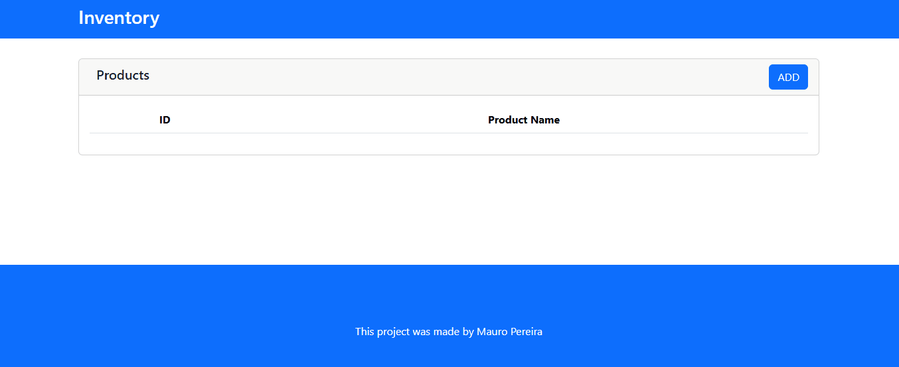

# 🛒 Inventory Management System

An **Inventory Management System** built using **Angular 19** and **NgRx** to manage products efficiently. This project integrates with a **Spring Boot** backend and provides a fully functional CRUD (Create, Read, Update, Delete) interface for  managing inventory and orders.

---

## 🚀 Features

- 📋 **View Products**: List all products in the inventory.
- ➕ **Add Products**: Easily add new items to the inventory.
- ✏️ **Update Products**: Modify product details such as name, price, stock, and description.
- 📋 **View Orders**: List all Orders in the systtem.
- ➕ **Add Orders**: Easily add new Orders and get real time updates On inventory.

- ❌ **Delete Products**: Remove unwanted products from the inventory.
- 🛠️ **State Management with NgRx**: Implements actions, reducers, selectors, and effects for seamless state handling.
- 🌐 **Backend Integration**: Communicates with a Spring Boot API for real-time data operations.

---

## 🛠️ Tech Stack

### Frontend
- **Angular 19**
- **NgRx** for state management
- **Bootstrap** for styling

### Backend
- **Spring Boot**
- **Grpc**
- **Microservices**
- **Websockets**
- **REST API**

---

## 📁 Project Structure

### Angular Folder Structure

src/
└── app/
    ├── features/
    │   ├── inventory/
    │   │   ├── components/
    │   │   │   └── product/
    │   │   │       ├── product.component.ts
    │   │   │       ├── product.component.html
    │   │   │       ├── product.component.css
    │   │   ├── models/
    │   │   │   └── product.model.ts
    │   │   ├── services/
    │   │   │   └── product.service.ts
    │   │   ├── store/
    │   │   │   ├── product.actions.ts
    │   │   │   ├── product.reducer.ts
    │   │   │   ├── product.selectors.ts
    │   │   │   └── product.effects.ts
    │   │   ├── inventory.module.ts
    │   │   └── inventory.routes.ts
    │
    │   ├── orders/
    │   │   ├── components/
    │   │   │   └── order/
    │   │   │       ├── order.component.ts
    │   │   │       ├── order.component.html
    │   │   │       ├── order.component.css
    │   │   ├── models/
    │   │   │   └── order.model.ts
    │   │   ├── services/
    │   │   │   └── order.service.ts
    │   │   ├── store/
    │   │   │   ├── order.actions.ts
    │   │   │   ├── order.reducer.ts
    │   │   │   ├── order.selectors.ts
    │   │   │   └── order.effects.ts
    │   │   ├── orders.module.ts
    │   │   └── orders.routes.ts
    │
    ├── app.module.ts
    ├── app.component.ts
    └── app.component.html
